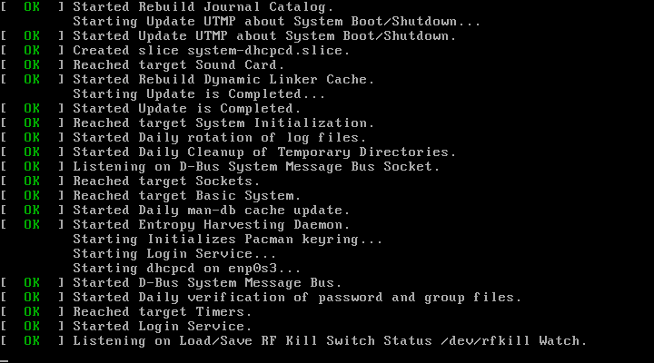
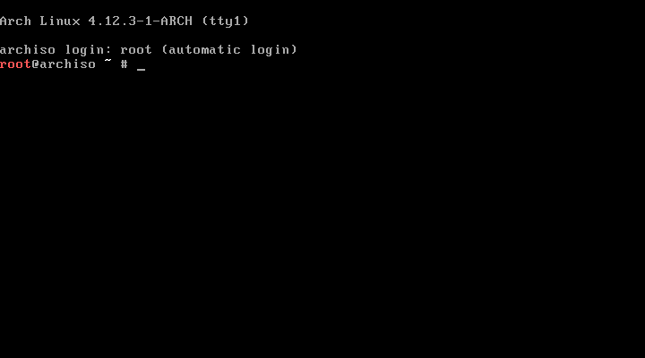
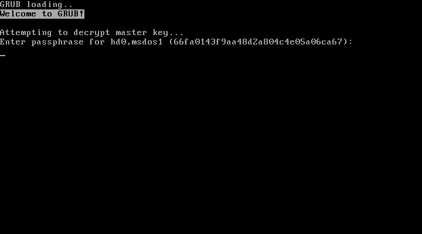
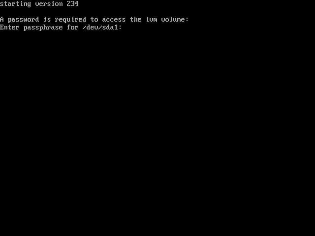
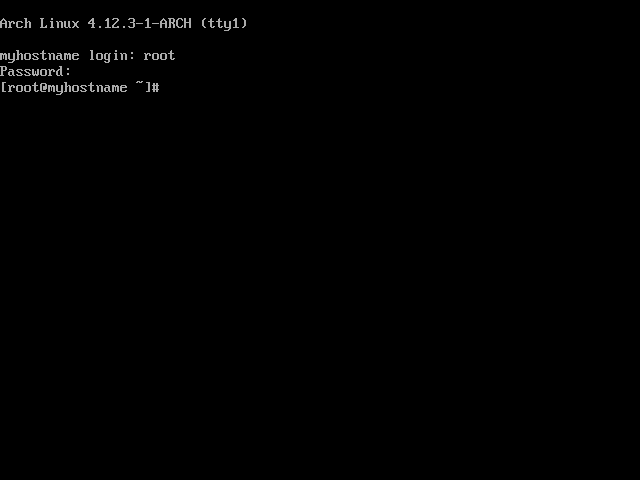

# Installazione Arch Linux Full Disk Encryption (LVM on LUKS) (incluso /boot)

La seguente repo contiene istruzioni minimali per installare Arch Linux con Full Disk Encryption (LVM su LULS) inclusa la partizione /boot.

Per istruzioni dettagliate fare riferimento alla guida ufficiale: [Installation guide (Italiano)](https://wiki.archlinux.org/index.php/Installation_guide_(Italiano))

#### N.B.: Nella cartella ```images``` sono presenti gli screenshot relativi ad una installazione di prova su macchina virtuale.

***
Scaricate una immagine iso da: https://www.archlinux.org/

Create una pennina bootable utilizzando la ISO che avete scaricato:

```shell
dd if=archlinux.img of=/dev/sdX bs=16M && sync # su linux
```

Eseguite il Boot dalla pennina USB appena creata.





Nelle istruzioni che seguono si assume che il boot sia stato eseguito correttamente e che vi troviate nella shell fornita dal setup di Arch Linux.

***

Connettetevi a una rete Wi-Fi utilizzando il comando

```shell
root@archiso ~ # wifi-menu
```
oppure usate un cavo ethernet.

Assicuratevi che la vostra connessione ad internet sia funzionante:
```shell
root@archiso ~ # ping google.com
PING google.com (216.58.198.46) 56(84) bytes of data.
64 bytes from mil04s04-in-f46.1e100.net (216.58.198.46): icmp_seq=1 ttl=51 time=19.4 ms
64 bytes from mil04s04-in-f46.1e100.net (216.58.198.46): icmp_seq=2 ttl=51 time=18.5 ms
64 bytes from mil04s04-in-f46.1e100.net (216.58.198.46): icmp_seq=3 ttl=51 time=19.7 ms
64 bytes from mil04s04-in-f46.1e100.net (216.58.198.46): icmp_seq=4 ttl=51 time=18.6 ms
^C
--- google.com ping statistics ---
4 packets transmitted, 4 received, 0% packet loss, time 3004ms
rtt min/avg/max/mdev = 18.538/19.119/19.783/0.541 ms
```

***

Identificate il disco sul quale volete installare Arch Linux utilizzando il comando:

```shell
root@archiso ~ # lsblk
```
In questa guida utilizzeremo il disco

```shell
NAME          MAJ:MIN RM   SIZE RO TYPE  MOUNTPOINT
sda             8:0    0 232.9G  0 disk
```

La struttura finale che vogliamo ottenere:

```shell
NAME          MAJ:MIN RM   SIZE RO TYPE  MOUNTPOINT
sda             8:0    0 232.9G  0 disk  
└─sda1          8:1    0 232.9G  0 part  
  └─lvm       254:0    0 232.9G  0 crypt 
    ├─vg-swap 254:1    0     4G  0 lvm   
    ├─vg-root 254:2    0    20G  0 lvm   /
    └─vg-home 254:3    0 208.9G  0 lvm   /home
```

***

Eseguiamo una pulizia del disco per eliminare eventuali dati sensibili:

```shell
shred -vfz --random-source=/dev/urandom -n 1 /dev/sda
```

Ci vorranno un paio di ore (minimo).

***

Iniziamo ora a partizionare il disco:

```shell
root@archiso ~ # parted -s /dev/sda mklabel msdos
root@archiso ~ # parted -s /dev/sda mkpart primary 2048s 100%
root@archiso ~ # cryptsetup -c aes-xts-plain64 -y --use-random --key-size 512 luksFormat /dev/sda1
```
```shell
root@archiso ~ # cryptsetup luksOpen /dev/sda1 lvm
root@archiso ~ # pvcreate /dev/mapper/lvm
root@archiso ~ # vgcreate vg /dev/mapper/lvm
```
```shell
root@archiso ~ # lvcreate -L 4G vg -n swap
root@archiso ~ # lvcreate -L 15G vg -n boot
root@archiso ~ # lvcreate -l +100%FREE vg -n home
```
```shell
root@archiso ~ # mkswap -L swap /dev/mapper/vg-swap
root@archiso ~ # mkfs.ext4 /dev/mapper/vg-boot
root@archiso ~ # mkfs.ext4 /dev/mapper/vg-home
```
```shell
root@archiso ~ # mount /dev/mapper/vg-boot /mnt
root@archiso ~ # mkdir /mnt/home
root@archiso ~ # mount /dev/mapper/vg-home /mnt/home
```
Un partizionamento di questo tipo mantiene separate le partizioni boot e home.

***

Eseguiamo il back up del file /etc/pacman.d/mirrorlist:

```shell
cp /etc/pacman.d/mirrorlist /etc/pacman.d/mirrorlist.backup
```
Dopo di che, eseguiamo il ranking dei mirrors utilizzando il parametro -n 6 per mostrare solamente i 6 mirror piu veloci:

```shell
rankmirrors -n 6 /etc/pacman.d/mirrorlist.backup > /etc/pacman.d/mirrorlist
```
A questo punto possiamo installare il sistema. Ho aggiunto anche alcuni pacchetti che tornano sicuramente utili al primo avvio del sistema:

```shell
root@archiso ~ # pacstrap -i /mnt base base-devel zsh vim git efibootmgr dialog wpa_supplicant
```
Generate l'fstab:

```shell
root@archiso ~ # genfstab -pU /mnt >> /mnt/etc/fstab
```
Aggiungete questa riga al file ```/mnt/etc/fstab:```
```shell
tmpfs /tmp tmpfs defaults,noatime,mode=1777 0 0
```

***

A questo punto, ho notato che queando si tenta di installare grub nei passaggi successi si incorre nell'errore

```shell
Failed to connect to lvmetad: No such file or directory.  Falling back to internal scanning. 
```

per evitare che ci siamo provlemi con lvm nei passaggi successivi, eseguite questi comandi:

```shell
root@archiso ~ # mkdir /mnt/hostrun
root@archiso ~ # mount --bind /run /mnt/hostrun
root@archiso ~ # arch-chroot /mnt /bin/bash
[root@archiso /]# mkdir /run/lvm
[root@archiso /]# mount --bind /hostrun/lvm /run/lvm
```

Notate che con ```root@archiso ~ # arch-chroot /mnt /bin/bash``` siamo anche entrati nella shell del nuovo sistema.

***

Passiamo ora alla configurazione di alcuni parametri minori del sistema:

Timezone:
```shell
[root@archiso /]# ln -sf /usr/share/zoneinfo/Europe/Rome /etc/localtime
[root@archiso /]# hwclock --systohc
```

Impostazioni di localizzazione:

Nel file ```/etc/locale.gen``` rimuovete il commento a ```en_US.UTF-8 UTF-8``` o altre localizzazioni di cui potreste aver bisogno.

Dopo di che:
```shell
[root@archiso /]# locale-gen
```

Impostate la variabile LANG in locale.conf ```/etc/locale.conf```:
```shell
[root@archiso /]# echo LANG=en_US.UTF-8 >> /etc/locale.conf
```

Hostname ```/etc/hostname```:
```shell
[root@archiso /]# echo myhostname >> /etc/hostname
```

Aggiungete la corrispondente entry nel file ```/etc/hosts```:
```shell
127.0.0.1	localhost.localdomain	localhost
::1		localhost.localdomain	localhost
127.0.1.1	myhostname.localdomain	myhostname
```

Impostate la password per l'utente root:
```shell
[root@archiso /]# passwd
```

Aggiungete un nuovo utente di sistema:
```shell
[root@archiso /]# useradd -m -g users -G wheel,games,power,optical,storage,scanner,lp,audio,video -s /bin/bash username
```

Impostate la password per l'utente appena creato:
```shell
[root@archiso /]# passwd username
```

Installate alcuni pacchetti che ci serviranno per terminare l'installazione:
```shell
[root@archiso /]# pacman -S sudo grub-bios os-prober
```

***

Possiamo ora configurare mkinitcpio:

```shell
[root@archiso /]# nano /etc/mkinitcpio.conf
```

Aggiungete ```ext4``` a ```MODULES``` e ```encrypt``` e ```lvm2``` a ```HOOKS``` prima di ```filesystems```.

Rigenerate l'immagine initrd:
```shell
[root@archiso /]# mkinitcpio -p linux
```

***

Ora possiamo configurare GRUB: dato che abbiamo criptato il disco interamente dobbiamo fornire alcune indicazioni nel file di configurazione di GRUB ```/etc/default/grub```.

Modifichiamo con nano
```shell
[root@archiso /]# nano /etc/default/grub
```

aggiungiamo il parametro ```cryptdevice``` per il kernel:
```shell
GRUB_CMDLINE_LINUX="cryptdevice=/dev/sda1:lvm"
```

e aggiungiamo la riga
```shell
GRUB_ENABLE_CRYPTODISK=y
```
in fondo al file di configurazione.

Dopo di che possiamo eseguire:

```shell
[root@archiso /]# grub-mkconfig -o /boot/grub/grub.cfg
[root@archiso /]# grub-install /dev/sda
```
***

Siamo giunti alla conclusione del processo di installazione. Potete semplicemente riavviare con i comandi:

```shell
[root@archiso /]# exit
root@archiso ~ # reboot
```

***
Dopo il riavvio, se l'installazione ha avuto esito positivo, vi ritroverete con le seguenti schermate per 
il boot: dovrete innanzitutto fornire la password a GRUB, dopo di che apparira' il menu di GRUB e, una 
volta scelto di avviare Arch Linux, dovrete inserire la password per decriptare il disco nuovamente.





***

# Installazione KDE Plasma
Dato che come ambiente di lavoro utilizzo KDE Plasma, di seguito le istruzioni necessarie per installarlo.

Per i comandi che seguono si presume che l'installazione di Arch Linux sia stata eseguita correttamente, che avete eseguito il boot del nuovo sistema installato e che siati loggati con l'utente `root`.

Eseguite il login con le credenziali di root,

Al primo boot dopo l'installazione il servizio dhcpcd non viene avviato automaticamente. Quindi 
connettetevi ad internet utilizzando una connessione Wi-Fi con il comando:
```shell
[root@myhostname ~]# wifi-menu
```

oppure ottenete il nome della vostra connessione ethernet con il comando
```shell
[root@myhostname ~]# ip addr
```
ed avviate il servizio dhcpcd:
```shel
[root@myhostname ~]# dhcpcd eth0
```
dove si suppone che l'interfaccia ethernet si chiami eth0.

Assicuratevi che la vostra connessione ad internet sia funzionante:
```shell
[root@myhostname ~]# ping google.com
PING google.com (216.58.198.46) 56(84) bytes of data.
64 bytes from mil04s04-in-f46.1e100.net (216.58.198.46): icmp_seq=1 ttl=51 time=19.4 ms
64 bytes from mil04s04-in-f46.1e100.net (216.58.198.46): icmp_seq=2 ttl=51 time=18.5 ms
64 bytes from mil04s04-in-f46.1e100.net (216.58.198.46): icmp_seq=3 ttl=51 time=19.7 ms
64 bytes from mil04s04-in-f46.1e100.net (216.58.198.46): icmp_seq=4 ttl=51 time=18.6 ms
^C
--- google.com ping statistics ---
4 packets transmitted, 4 received, 0% packet loss, time 3004ms
rtt min/avg/max/mdev = 18.538/19.119/19.783/0.541 ms
```

***

Prima di procedere con l'installazione apportiamo alcune modifiche al file di configurazione del gestore di 
pacman di Arch ```/etc/pacman.conf```:
```shell
[root@myhostname ~]# nano /etc/pacman.conf
```
rimuovere i commenti per
```shell
[multilib]
include = /etc/pacman.d/mirrorlist
```
e aggiungere il seguente contenuto in fondo al file di configurazione:
```shell
[archlinuxfr]
SigLevel = Never
Server = http://repo.archlinux.fr/$arch
```

Aggiorniamo le repo:
```shell
[root@myhostname ~]# pacman -Syyu
```

Iniziamo installando i pacchetti di cui abbiamo bisogno:

```shell
[root@myhostname ~]# pacman -Syu xorg-server xorg-apps yaourt plasma sddm sddm-kcm 
[root@myhostname ~]# pacman -Syu firefox kde-applications breeze-gtk breeze-kde4 kde-gtk-config plasma-nm xorg-xinit linux-headers 
[root@myhostname ~]# pacman -Syu virtualbox-guest-utils virtualbox-guest-modules-arch
```
potete anche installare i pacchetti separatamente se preferite. Questo processo di installazione risulta 
parecchio lungo a seconda della connessione internet che state utilizzando e della macchina su cui vi 
trovate a lavorare.

###### N.B: i pacchetti ```virtualbox-guest-utils virtualbox-guest-modules-arch``` sono stati 
installati per permettere a xorg di funzionare correttamente con VirtualBox.

Successivamente abilitate sddm
```shell
[root@myhostname ~]# systemctl enable sddm
```
e il networkmanager
```shell
[root@myhostname ~]# systemctl enable NetworkManager
```

A questo punto potete riavviare il sistema:
```shell
[root@myhostname ~]# reboot
```

***

Al successivo riavvio dovrebbe avviarsi la schermata di login fornita da sddm, dove potete eseguire l'accesso con l'utente creato durante il processo di installazione.

***

# Riferimenti
Per maggiori informazioni e per capire quello che state facendo, potete consultare i seguenti riferimenti 
che ho utilizzato per mettere assieme i comandi necessari.

[How To Securely Destroy/Wipe Data On Hard Drives With 
shred](https://www.howtoforge.com/how-to-securely-destroy-wipe-data-on-hard-drives-with-shred)

[Full disk encryption with LUKS (including /boot) · Pavel 
Kogan](http://www.pavelkogan.com/2014/05/23/luks-full-disk-encryption/)

[KDE (Italiano) - ArchWiki](https://wiki.archlinux.org/index.php/KDE_(Italiano))

[Minimal instructions for installing arch linux on an UEFI system with full system encryption using 
dm-crypt and luks · GitHub](https://gist.github.com/mattiaslundberg/8620837)

[How to install Arch Linux with Full Disk 
Encryption](https://www.howtoforge.com/tutorial/how-to-install-arch-linux-with-full-disk-encryption/)

[Arch Grub-mkconfig Lvmetad Failures Inside Chroot 
Install](https://www.google.it/amp/s/www.pckr.co.uk/arch-grub-mkconfig-lvmetad-failures-inside-chroot-install/amp/)

[Xorg (Italiano)](https://wiki.archlinux.org/index.php/Xorg_(Italiano))

[KDE](https://wiki.archlinux.org/index.php/KDE)

[How to install Kde Plasma 5 on Arch 
Linux](http://fasterland.net/how-to-install-kde-plasma-5-on-arch-linux.html)

[How To Install Yaourt In Arch Linux](https://www.ostechnix.com/install-yaourt-arch-linux/)

[Arch User Repository (Italiano)](https://wiki.archlinux.org/index.php/Arch_User_Repository_(Italiano))

[SDDM](https://wiki.archlinux.org/index.php/SDDM)

--

Rambod Rahmani <<rambodrahmani@autistici.org>>
